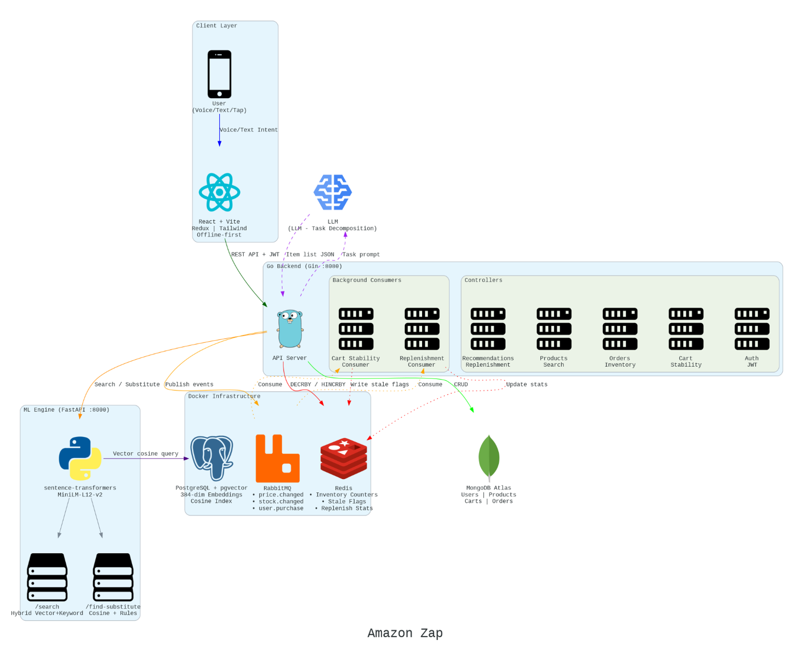
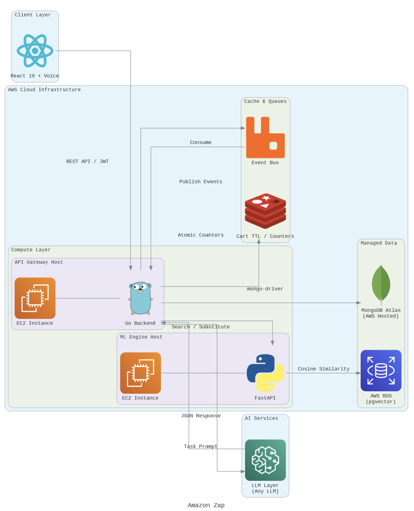

# ⚡ Amazon Zap: Intelligent Quick-Commerce System

> **Reimagining Urgent Shopping**: From intent to confirmed order in under 30 seconds.

Built for **Amazon HackOn 2026**  Theme: *Amazon Now Reimagining Urgent Shopping*

---

## 🧠 The Problem

Quick-commerce delivers in 10 minutes. But the customer spends **15 minutes deciding what to order**. The bottleneck isn't the rider, it's the shopping itself.

---

## 🏗️ Architecture

### System Design (Detailed)



### AWS Deployment Architecture



---

## ✨ Five Core Features

| # | Feature | What It Does |
|---|---------|-------------|
| 1 | **Intent-to-Cart Compiler** | 🎤 Speak "make paneer butter masala" → LLM decomposes → vector search → full purchasable cart in 5 seconds |
| 2 | **Probabilistic Substitution Integrity Layer** | Out-of-stock item → auto-suggests closest alternative (60% semantic + 30% price + 10% brand scoring) |
| 3 | **Autonomous Cart Stability System** | Cart self-corrects on price changes, stock fluctuations, and network drops. Event-driven + offline-first. |
| 4 | **Consumption Forecasting & Replenishment Engine** | Learns purchase rhythm from 2nd order. Overdue items surface automatically. Zero setup. |
| 5 | **Anti-Double Spend Inventory Enforcement Layer** | Redis atomic DECRBY ensures each unit reserved exactly once. No overselling under any concurrency. |

---

## 🛠️ Tech Stack

| Layer | Technology |
|-------|-----------|
| Frontend | React 19, Vite 8, Redux Toolkit, Tailwind CSS 4, Web Speech API |
| Backend | Go (Gin), JWT Auth, RabbitMQ consumers |
| ML Engine | Python FastAPI, sentence-transformers (MiniLM-L12-v2) |
| AI | Google Gemini (task decomposition) |
| Vector DB | PostgreSQL + pgvector (384-dim embeddings, cosine similarity) |
| Operational DB | MongoDB Atlas |
| Cache | Redis (inventory counters, stale flags, replenishment stats) |
| Event Bus | RabbitMQ (topic exchange: price.changed, stock.changed, user.purchase) |
| Infra | AWS EC2, Docker Compose |

---

## 🚀 Quick Start

### Prerequisites
- Docker Desktop
- Go 1.25+
- Node.js 22+
- Python 3.10+

### First Time Setup
```bash
make build
```
This installs all dependencies (Go, Node, Python/PyTorch), starts Docker infra, and seeds the ML engine with product embeddings.

### Run (after build)
```bash
make run
```

### Services
| Service | URL |
|---------|-----|
| Frontend | http://localhost:5173 |
| Backend API | http://localhost:8080 |
| ML Engine | http://localhost:8000 |
| RabbitMQ UI | http://localhost:15672 |
| Admin Panel | http://localhost:3001 |

### Stop
```bash
make stop
```

---

## 📁 Project Structure

```
├── Client/              # React frontend (Vite + Redux + Tailwind)
│   └── src/
│       ├── components/  # UI (Header, Cart, Checkout, Search, TaskShopping)
│       └── features/    # Redux slices (cart, auth, orders, recommendations, stability)
│
├── Server/              # Go backend (Gin)
│   ├── controllers/     # Auth, Cart, Products, Orders, Recommendations, Admin
│   ├── services/        # Redis, RabbitMQ, LLM, Inventory, Consumers
│   ├── middleware/      # JWT Auth, CORS
│   └── models/          # MongoDB document schemas
│
├── ml_engine/           # Python FastAPI (sentence-transformers + pgvector)
│   └── main.py          # /search, /find-substitute, /seed endpoints
│
├── admin/               # Standalone admin panel (port 3001)
├── docker-compose.yml   # Redis + RabbitMQ + PostgreSQL+pgvector
└── Makefile             # make build | make run | make stop
```

---

## 🔑 Key Algorithms

- **Hybrid Vector + Keyword Search**: Cosine similarity (pgvector) merged with ILIKE keyword boost. O(log n) with IVFFlat index.
- **Probabilistic Substitution Scoring**: `0.6×semantic + 0.3×price_proximity + 0.1×brand_match`
- **Replenishment Formula**: `weighted_score = 0.6 × (gap/avg_interval) + 0.4 × log(count+1)`. Works from 2nd purchase, no ML training.
- **Atomic Inventory**: Redis DECRBY (O(1), sub-ms). Same pattern as ticketing systems handling 100k concurrent requests.

---

## 👥 Team

**Team Duo**: Built for Amazon HackOn 2026
